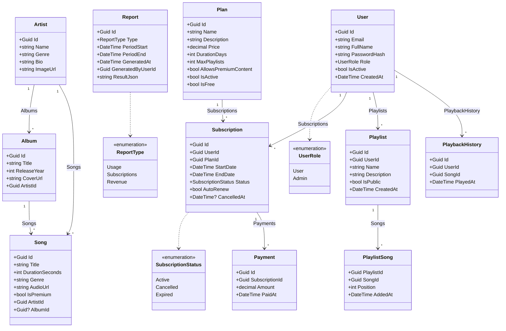
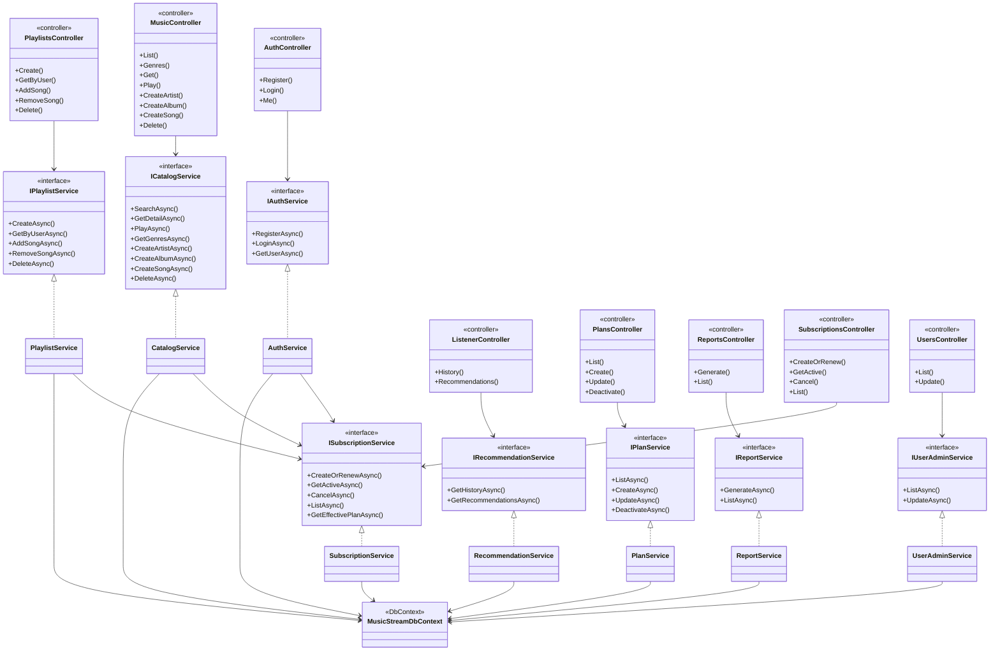

# Diagrama de clases

> Documento generado automáticamente por `MusicStream.DocGen` (workflow `generate-documentation.yml`). No editar manualmente.

## Dominio

```mermaid
classDiagram
    class Album {
        +Guid Id
        +string Title
        +int ReleaseYear
        +string CoverUrl
        +Guid ArtistId
    }
    class Artist {
        +Guid Id
        +string Name
        +string Genre
        +string Bio
        +string ImageUrl
    }
    class Payment {
        +Guid Id
        +Guid SubscriptionId
        +decimal Amount
        +DateTime PaidAt
    }
    class Plan {
        +Guid Id
        +string Name
        +string Description
        +decimal Price
        +int DurationDays
        +int MaxPlaylists
        +bool AllowsPremiumContent
        +bool IsActive
        +bool IsFree
    }
    class PlaybackHistory {
        +Guid Id
        +Guid UserId
        +Guid SongId
        +DateTime PlayedAt
    }
    class Playlist {
        +Guid Id
        +Guid UserId
        +string Name
        +string Description
        +bool IsPublic
        +DateTime CreatedAt
    }
    class PlaylistSong {
        +Guid PlaylistId
        +Guid SongId
        +int Position
        +DateTime AddedAt
    }
    class Report {
        +Guid Id
        +ReportType Type
        +DateTime PeriodStart
        +DateTime PeriodEnd
        +DateTime GeneratedAt
        +Guid GeneratedByUserId
        +string ResultJson
    }
    class ReportType {
        <<enumeration>>
        Usage
        Subscriptions
        Revenue
    }
    class Song {
        +Guid Id
        +string Title
        +int DurationSeconds
        +string Genre
        +string AudioUrl
        +bool IsPremium
        +Guid ArtistId
        +Guid? AlbumId
    }
    class Subscription {
        +Guid Id
        +Guid UserId
        +Guid PlanId
        +DateTime StartDate
        +DateTime EndDate
        +SubscriptionStatus Status
        +bool AutoRenew
        +DateTime? CancelledAt
    }
    class SubscriptionStatus {
        <<enumeration>>
        Active
        Cancelled
        Expired
    }
    class User {
        +Guid Id
        +string Email
        +string FullName
        +string PasswordHash
        +UserRole Role
        +bool IsActive
        +DateTime CreatedAt
    }
    class UserRole {
        <<enumeration>>
        User
        Admin
    }
    Album "1" --> "*" Song : Songs
    Artist "1" --> "*" Album : Albums
    Artist "1" --> "*" Song : Songs
    Plan "1" --> "*" Subscription : Subscriptions
    Playlist "1" --> "*" PlaylistSong : Songs
    Report ..> ReportType
    Subscription ..> SubscriptionStatus
    Subscription "1" --> "*" Payment : Payments
    User ..> UserRole
    User "1" --> "*" Subscription : Subscriptions
    User "1" --> "*" Playlist : Playlists
    User "1" --> "*" PlaybackHistory : PlaybackHistory
```

## Servicios y controladores

```mermaid
classDiagram
    class IAuthService {
        <<interface>>
        +RegisterAsync()
        +LoginAsync()
        +GetUserAsync()
    }
    class AuthService
    IAuthService <|.. AuthService
    AuthService --> ISubscriptionService
    AuthService --> MusicStreamDbContext
    class ICatalogService {
        <<interface>>
        +SearchAsync()
        +GetDetailAsync()
        +PlayAsync()
        +GetGenresAsync()
        +CreateArtistAsync()
        +CreateAlbumAsync()
        +CreateSongAsync()
        +DeleteAsync()
    }
    class CatalogService
    ICatalogService <|.. CatalogService
    CatalogService --> ISubscriptionService
    CatalogService --> MusicStreamDbContext
    class IPlanService {
        <<interface>>
        +ListAsync()
        +CreateAsync()
        +UpdateAsync()
        +DeactivateAsync()
    }
    class PlanService
    IPlanService <|.. PlanService
    PlanService --> MusicStreamDbContext
    class IPlaylistService {
        <<interface>>
        +CreateAsync()
        +GetByUserAsync()
        +AddSongAsync()
        +RemoveSongAsync()
        +DeleteAsync()
    }
    class PlaylistService
    IPlaylistService <|.. PlaylistService
    PlaylistService --> ISubscriptionService
    PlaylistService --> MusicStreamDbContext
    class IRecommendationService {
        <<interface>>
        +GetHistoryAsync()
        +GetRecommendationsAsync()
    }
    class RecommendationService
    IRecommendationService <|.. RecommendationService
    RecommendationService --> MusicStreamDbContext
    class IReportService {
        <<interface>>
        +GenerateAsync()
        +ListAsync()
    }
    class ReportService
    IReportService <|.. ReportService
    ReportService --> MusicStreamDbContext
    class ISubscriptionService {
        <<interface>>
        +CreateOrRenewAsync()
        +GetActiveAsync()
        +CancelAsync()
        +ListAsync()
        +GetEffectivePlanAsync()
    }
    class SubscriptionService
    ISubscriptionService <|.. SubscriptionService
    SubscriptionService --> MusicStreamDbContext
    class IUserAdminService {
        <<interface>>
        +ListAsync()
        +UpdateAsync()
    }
    class UserAdminService
    IUserAdminService <|.. UserAdminService
    UserAdminService --> MusicStreamDbContext
    class MusicStreamDbContext {
        <<DbContext>>
    }
    class AuthController {
        <<controller>>
        +Register()
        +Login()
        +Me()
    }
    AuthController --> IAuthService
    class ListenerController {
        <<controller>>
        +History()
        +Recommendations()
    }
    ListenerController --> IRecommendationService
    class MusicController {
        <<controller>>
        +List()
        +Genres()
        +Get()
        +Play()
        +CreateArtist()
        +CreateAlbum()
        +CreateSong()
        +Delete()
    }
    MusicController --> ICatalogService
    class PlansController {
        <<controller>>
        +List()
        +Create()
        +Update()
        +Deactivate()
    }
    PlansController --> IPlanService
    class PlaylistsController {
        <<controller>>
        +Create()
        +GetByUser()
        +AddSong()
        +RemoveSong()
        +Delete()
    }
    PlaylistsController --> IPlaylistService
    class ReportsController {
        <<controller>>
        +Generate()
        +List()
    }
    ReportsController --> IReportService
    class SubscriptionsController {
        <<controller>>
        +CreateOrRenew()
        +GetActive()
        +Cancel()
        +List()
    }
    SubscriptionsController --> ISubscriptionService
    class UsersController {
        <<controller>>
        +List()
        +Update()
    }
    UsersController --> IUserAdminService
```
