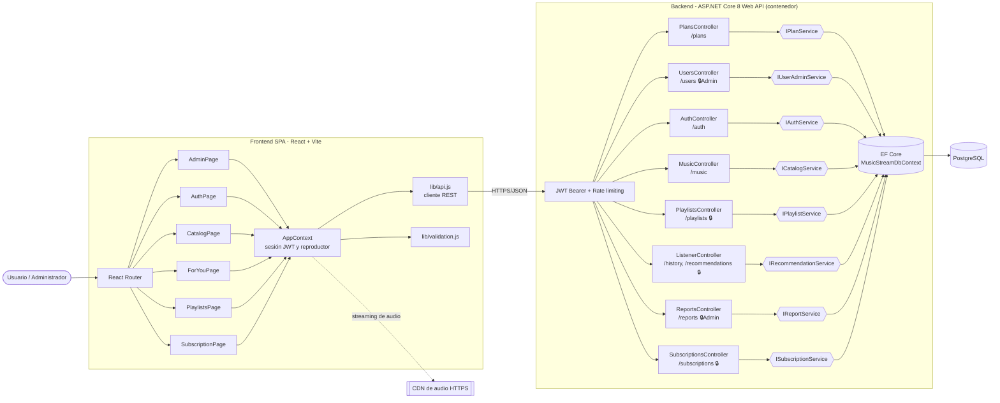

# Diagrama de componentes

> Documento generado automáticamente por `MusicStream.DocGen` (workflow `generate-documentation.yml`). No editar manualmente.

```mermaid
flowchart LR
    user([Usuario / Administrador])
    subgraph FE["Frontend SPA - React + Vite"]
        router[React Router]
        ctx[AppContext<br/>sesión JWT y reproductor]
        apiClient[lib/api.js<br/>cliente REST]
        validation[lib/validation.js]
        AdminPage[AdminPage]
        AuthPage[AuthPage]
        CatalogPage[CatalogPage]
        ForYouPage[ForYouPage]
        PlaylistsPage[PlaylistsPage]
        SubscriptionPage[SubscriptionPage]
    end
    subgraph BE["Backend - ASP.NET Core 8 Web API (contenedor)"]
        auth[JWT Bearer + Rate limiting]
        AuthController["AuthController<br/>/auth"]
        ListenerController["ListenerController<br/>/history, /recommendations 🔒"]
        MusicController["MusicController<br/>/music"]
        PlansController["PlansController<br/>/plans"]
        PlaylistsController["PlaylistsController<br/>/playlists 🔒"]
        ReportsController["ReportsController<br/>/reports 🔒Admin"]
        SubscriptionsController["SubscriptionsController<br/>/subscriptions 🔒"]
        UsersController["UsersController<br/>/users 🔒Admin"]
        IAuthService{{IAuthService}}
        ICatalogService{{ICatalogService}}
        IPlanService{{IPlanService}}
        IPlaylistService{{IPlaylistService}}
        IRecommendationService{{IRecommendationService}}
        IReportService{{IReportService}}
        ISubscriptionService{{ISubscriptionService}}
        IUserAdminService{{IUserAdminService}}
        efcore[(EF Core<br/>MusicStreamDbContext)]
    end
    db[(PostgreSQL)]
    cdn[[CDN de audio HTTPS]]
    user --> router
    router --> AdminPage
    router --> AuthPage
    router --> CatalogPage
    router --> ForYouPage
    router --> PlaylistsPage
    router --> SubscriptionPage
    AdminPage --> ctx
    AuthPage --> ctx
    CatalogPage --> ctx
    ForYouPage --> ctx
    PlaylistsPage --> ctx
    SubscriptionPage --> ctx
    ctx --> apiClient
    ctx --> validation
    apiClient -- HTTPS/JSON --> auth
    auth --> AuthController
    AuthController --> IAuthService
    auth --> ListenerController
    ListenerController --> IRecommendationService
    auth --> MusicController
    MusicController --> ICatalogService
    auth --> PlansController
    PlansController --> IPlanService
    auth --> PlaylistsController
    PlaylistsController --> IPlaylistService
    auth --> ReportsController
    ReportsController --> IReportService
    auth --> SubscriptionsController
    SubscriptionsController --> ISubscriptionService
    auth --> UsersController
    UsersController --> IUserAdminService
    IPlanService --> efcore
    IUserAdminService --> efcore
    IAuthService --> efcore
    ICatalogService --> efcore
    IPlaylistService --> efcore
    IRecommendationService --> efcore
    IReportService --> efcore
    ISubscriptionService --> efcore
    efcore --> db
    ctx -. streaming de audio .-> cdn
```
